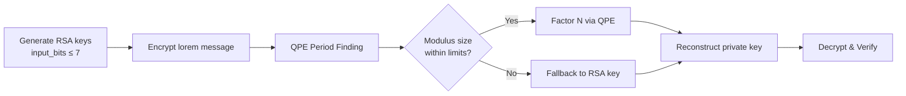

# RSA_SHOR_Simulator

This repository provides a Python-based instructional implementation of:

- RSA key generation, encryption, and decryption
- Supporting classical arithmetic procedures (prime generation, GCD, modular inverse)
- A Qiskit-based simulation workflow motivated by Shor's algorithm for recovering factors of small RSA moduli

## Project Goal

The primary objective of this project is to offer an educational simulation environment for studying RSA and for illustrating how quantum period-finding concepts can be applied to factor small RSA-style examples under simulator constraints.

## Setup and Prerequisites

All installation, environment initialization, and prerequisite instructions are maintained in:

- [Prerequisite and context guide](documentations/prerequisite_requirements.md)

This document should be treated as the authoritative reference for preparing both the host system and Python environment.

## Repository Structure

```text
RSA_SHOR_Simulator/
├── RSA_SHOR_main.py
├── run.bat
├── batch_scripts/
│   ├── setup.bat
│   └── requirements.txt
├── documentations/
│   ├── breaker_flow.md
│   ├── code_flow.md
│   └── prerequisite_requirements.md
└── module_scripts/
    ├── arithmeticModule.py
    ├── rsaModule.py
    └── shorModule.py
```

## Running the Simulator

After completing the documented setup procedure, execute:

```bat
python RSA_SHOR_main.py
```

At runtime, the script performs the following sequence:

1. Generates Lorem Ipsum text as sample plaintext
2. Generates RSA key pairs (`p`, `q`, `n`, `e`, `d`)
3. Prompts for input bit-length (max 7 for QPE constraints)
4. Applies RSA encryption
5. Executes Quantum Phase Estimation (QPE) for period-finding to factor the modulus
6. Applies automatic fallback to standard RSA key for unsupported modulus sizes
7. Decrypts using recovered (or fallback) private key
8. Verifies equivalence between original and decrypted plaintext

## Quick Demo

Illustrative console workflow:

1. Launch the program with `python RSA_SHOR_main.py`
2. Provide a bit size when prompted (range: 1–7 for QPE; larger sizes fall back to standard RSA)
3. Inspect the reported RSA parameters, encryption, and decryption outputs
4. Observe QPE-based period finding and private-key recovery (or fallback behavior)
5. Confirm that the final verification statement evaluates to `True`

## Important Notes

- The script is configured for QPE-based Shor's algorithm by default.
- The `input_bits` prompt refers to the bit-length of each prime (`p` and `q`), not modulus bit-length.
- RSA modulus size is approximately `2 * input_bits`.
- **QPE constraint:** Maximum supported modulus is 2^15 = 32,768 (achieved with max `input_bits = 7`).
- If modulus size exceeds QPE capacity, execution gracefully falls back to the original RSA-generated private key.
- Backend: Qiskit Aer `qasm_simulator` (31 qubits available: 15 counting + 15 work + 1 ancilla).
- This repository is designed for instructional use and does not represent a production-grade cryptographic implementation.

## Known Limitations

- The implementation targets demonstration-scale inputs and is not suitable for real RSA security parameters.
- Quantum behavior is emulated via Qiskit Aer and is not executed on physical quantum hardware.
- Computational cost increases with input size and simulation-circuit overhead.

## Compatibility

- Primary execution flow is Windows-oriented via `run.bat` and `batch_scripts/setup.bat`.
- Recommended Python version is 3.10 or later.
- Dependency specifications are maintained in `batch_scripts/requirements.txt`.

## Architecture Flow



For implementation-level flow references, see:

- [Period Function Code Flow Add-on](documentations/code_flow.md)
- [Shor Breaker Flow Add-on](documentations/breaker_flow.md)

## What This Project Demonstrates

1. End-to-end RSA key-generation and encryption/decryption workflow
2. Core arithmetic primitives relevant to public-key cryptography (GCD and modular inverse)
3. A quantum-simulation pathway for factoring small RSA modulus values
4. Reconstruction of a private key from recovered factors

## Module Summary

- **module_scripts/arithmeticModule.py**
  - Primality-testing helpers
  - Prime generation
  - Extended Euclidean Algorithm (GCD and modular inverse)
  - Naive factorization utility

- **module_scripts/rsaModule.py**
  - RSA keypair generation
  - RSA encryption/decryption routines
  - RSA parameter reporting

- **module_scripts/shorModule.py** (QPE-only implementation)
  - `shor_algorithm(pk)`: Main entry point for RSA factorization
  - `shors_breaker(backend, N, max_attempts=15)`: Factorization loop with random basis selection
  - `period(backend, a, N, counting_bits, work_bits)`: Quantum Phase Estimation (QPE) for period-finding
  - `extract_period_from_counts(counts, counting_bits, a, N)`: Classical post-processing via continued fractions
  - **Constants:** `COUNTING_QUBITS=15`, `WORK_QUBITS=15`, `ANCILLA_QUBITS=1`
  - **Graceful degradation:** Returns `None` if N exceeds 2^WORK_QUBITS capacity
