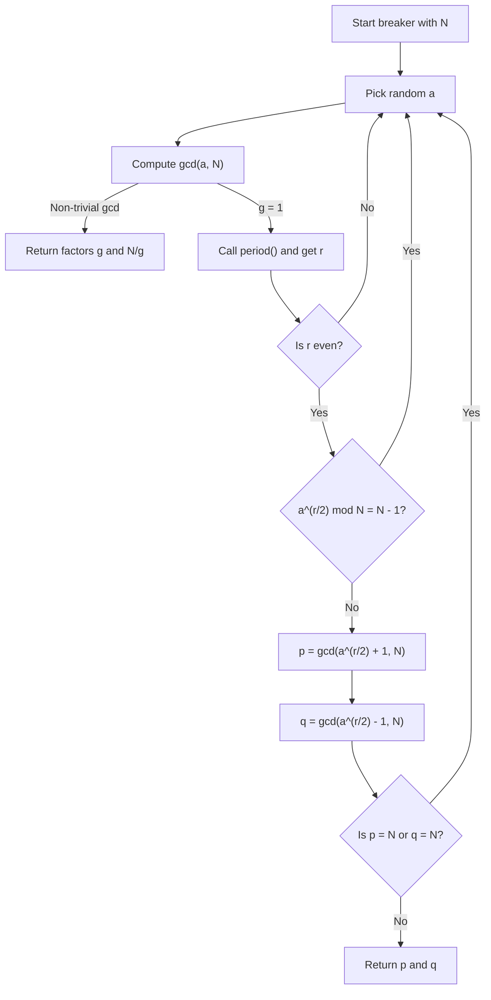

# Shor Breaker Flow

This diagram represents the code path in `shors_breaker()` and highlights the retry conditions that lead to successful factor recovery.

```mermaid
flowchart TD

    A["Start breaker with N"]
    A --> B["Pick random a"]
    B --> C["Compute gcd(a, N)"]

    C -->|"Non-trivial gcd"| D["Return factors g and N/g"]
    C -->|"g = 1"| E["Call period() and get r"]

    E --> F{"Is r even?"}

    F -->|"No"| B
    F -->|"Yes"| G{"a^(r/2) mod N = N - 1?"}

    G -->|"Yes"| B
    G -->|"No"| H["p = gcd(a^(r/2) + 1, N)"]

    H --> I["q = gcd(a^(r/2) - 1, N)"]

    I --> J{"Is p = N or q = N?"}

    J -->|"Yes"| B
    J -->|"No"| K["Return p and q"]
```
