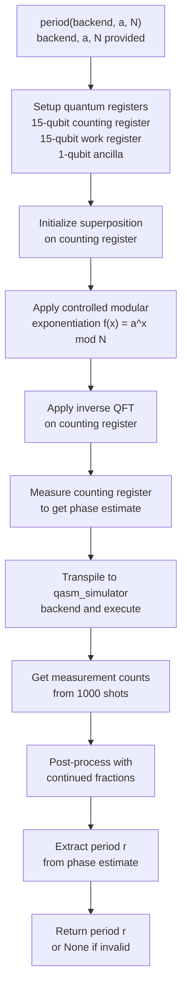

# Period Function Code Flow (QPE Implementation)

This diagram represents the Quantum Phase Estimation (QPE) implementation in `period()`, which performs quantum period-finding followed by classical post-processing.

**Key Steps:**
- Superposition creation allows simultaneous evaluation of f(x) = a^x mod N
- Inverse QFT maps phase information to measurable computational basis
- Continued fractions extracts period r from discrete phase samples
- Graceful failure: Returns `None` if modulus N exceeds work register capacity (2^15)