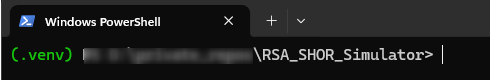
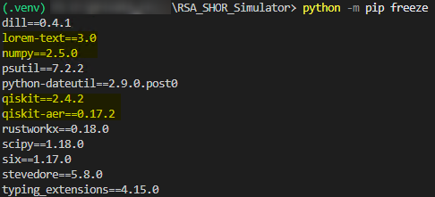

# Breaking RSA Using Quantum Simulation
### Preparation Guide and Context Documentation
---
~~~
Title: Breaking RSA using Quantum Simulation
Author: Avinash M
Company: Bosch
~~~

---

## Table Of Contents
1. [Purpose](#1-purpose)
2. [Execution Approach](#2-execution-approach-important)
3. [Core Requirements](#3-core-requirements)
    1. [Install Python](#31-install-python-3)
    2. [Command Selection](#32-python-command-selection-important)
    3. [Pip availability](#33-ensure-pip-is-available)
4. [System Readiness](#4-system-readiness)
5. [Environment Setup](#5-environment-setup)
    1. [Using Virtual Environment](#recommended-use-a-virtual-environment)
    2. [(Alternative) System Wide Installation](#alternative-system-wide-installation-not-recommended)
6. [Package Installation](#6-package-installation)
    1. [Upgrade pip](#step-1-upgrade-pip)
    2. [Create requirements file](#step-2-create-requirementstxt)
    3. [Install Dependencies](#step-3-install-dependencies)
    4. [Verify Dependencies](#step-4-verify-dependencies)
7. [Context: Breaking RSA using Quantum Simulation](#7-context-breaking-rsa-using-quantum-simulation)
    1. [The Problem](#the-problem)
    2. [The Quantum Insight](#the-quantum-insight)
    3. [What Shor's Algorithm Does](#what-shors-algorithm-does)
    4. [Where Quantum Helps](#where-quantum-helps)
    5. [What you will run](#what-you-will-run-qiskit)
    6. [Reality Check](#reality-check)
    7. [One Line Flow](#one-line-flow)

---

## 1. Purpose

This document ensures that all participants have a **fully prepared Python environment** before the project is shared.

### Objectives
- Enable direct execution of the project without setup scripts
- Avoid last-minute installations and failures
- Ensure consistent environment across systems

---

## 2. Execution Approach (Important)

Once the project is shared, you can choose:

### Preferred: Direct Execution
If your system is prepared, you can run the project directly:

```bash
python main.py
```

---

## 3. Core Requirements

### 3.1 Install Python 3

Install **Python 3.x (Recommended: 3.10 or later)**.

Checkout the [Python Downloads Page](https://www.python.org/downloads/) for latest python versions and install the latest.

Before exiting the installer, Ensure "*Add Python to PATH*" is checked during install.

---

### 3.2 Python Command Selection (Important)

After verifying Python installation, ensure that the `python` command correctly points to a valid Python 3 interpreter.


#### Step 1: Check Python version

Run:

```bash
python --version
```

#### Step 2: Validate output

**Case 1:** Python 3.x (Correct)

Example:
```t
Python 3.10.x
```

You can continue using python for all commands.


**Case 2:** Python version is below 3

Example:
```t
Python 2.7.x
```
 Use Python 3 explicitly:

**Windows:**
```bat
py -3
```
**Linux/macOS:**
```bash
python3
```

**Case 3:** 'python' not recognized

Python is either not installed correctly or not in PATH.

Try:

**Windows:**
```bat
py -3 --version
```
**Linux/macOS:**
```bash
python3 --version
```

---

> If this works, use the respective command (py -3 or python3) instead of python

---

### 3.3 Ensure pip is Available
pip is required to install dependencies during setup. In modern python pip is included by default.

#### Verify pip:
```bash
python -m pip --version
```

Must return valid pip version

---

## 4 System Readiness
Quick basic system requirements checklist.

- [X] Internet Access
- [X] Permissions to create directories, install packages and execute scripts
- [X] Disk Space (~ 100 - 500 MB)

---

## 5. Environment Setup

There are two ways to install and run the project. Install and run packages via 
1. A python virtual environment (**Recommended**)
2. System wide installation and access

---

### Recommended: Use a Virtual Environment

This approach isolates project dependencies from the system Python installation and avoids conflicts between projects.

#### Why this is recommended:
- Prevents dependency conflicts
- Keeps system Python clean
- Ensures reproducibility

Follow the steps below:


#### Step 1: Create virtual environment

```bash
python -m venv .venv
```

#### Step 2: Activate environment

**Windows:**
```sh
.venv\Scripts\activate
```
**Linux/macOS:**
```bash
source .venv/bin/activate
```
Expected Behavior:

Your terminal prompt may change (e.g., showing (.venv)). The python command now points to the virtual environment



Continue with [Package Installation](#package-installation)

### Alternative: System-Wide Installation (Not Recommended)

You may install dependencies directly into your system Python environment.

``` --- Skip the python environment creation and activation altogether ---```

Jump to [Package Installation](#package-installation)

Limitations of this approach:

- May cause conflicts with other Python projects
- Harder to manage dependencies
- Not aligned with typical project isolation practices

Use this only if:

- You are familiar with Python environment management
- You explicitly prefer system-level installs

---
## 6. Package Installation

#### Step 1: Upgrade pip

```bash
python -m pip install --upgrade pip
```

#### Step 2: Create requirements.txt
This text file helps specify requirements and can be used with pip to check and install requirements.

> requirements.txt
```t
## Content for requirements.txt file
# Requirements for the Python environment setup
numpy>=1.24.3
lorem_text>=2.0.1

# Quantum computing libraries
qiskit>=0.43.2
qiskit-aer>=0.13.4
```
#### (Alternative) Step 2: Create the file using the command line

Ensure your terminal / command prompt is opened in the desired project folder.

You can create and edit the file directly:

**Windows:**
```sh
notepad requirements.txt
```
**Linux/macOS:**
```bash
nano requirements.txt
```
This will create the file if it does not already exist. After opening the editor, paste the required content and save the file.

#### Step 3: Install Dependencies
```bash
python -m pip install -r requirements.txt
```

#### Step 4: Verify Dependencies

```bash
python -m pip freeze
```



Ensure the packages from the requirement (also highlighted in yellow in the screenshot) are present.

---

$$
-\ End\  Of\  Setup\ -
$$


---
> **Tip:** If you're new to quantum computing, don't worry about full understanding at this stage. 
> Once we run the project — the concepts will make more sense during the walkthrough.
---
## 7. Context: Breaking RSA using Quantum Simulation

Before running the project, here is a quick high-level view of what you will be working with.

---

### The Problem

- RSA security is based on the difficulty of factoring:
$$
n = p \times q
$$
- Classical systems take extremely long to factor large numbers.

---

### The Quantum Insight

Instead of directly factoring n:

The problem is converted into **finding the period** of a function

$$
f(x) = a^x \ mod\ n 
$$
---

### What Shor’s Algorithm Does

1. Picks a random number `a`
2. Builds a periodic function:
$$   
f(x) = a^x\ mod\ n
$$
3. Uses quantum computation to find:
   
   Period `r` such that:
   $$
   a^r \equiv 1\ mod\ n
   $$

4. Uses classical math to compute factors of `n`

---

### Where Quantum Helps

- **Superposition** → Evaluate many values of x simultaneously  
- **Quantum Fourier Transform (QFT)** → Extract periodicity efficiently  
- **Interference** → Amplify correct answers  

---

### What You Will Run (Qiskit)

- Build a quantum circuit
- Simulate using Qiskit Aer backend
- Extract measurement results
- Derive the period and factors

---

### Reality Check

- Works on small numbers in simulation (e.g., 15, 21)
- Real RSA (2048-bit) still requires large-scale quantum hardware

---

### One-Line Flow

RSA → Factorization Hard → `Convert to Period Finding →  Quantum Circuit (QFT)` → Period → Factors

---

> You don't need to understand every concept deeply before running the project. 
> This is just to give you a **mental model of what’s happening under the hood**.
